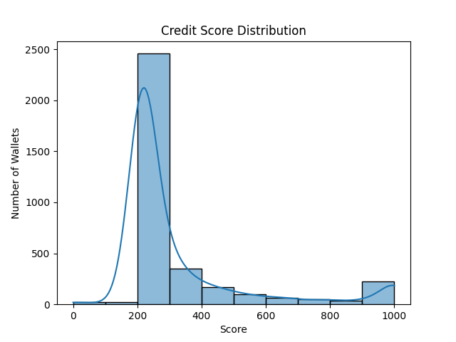

# Credit Score Analysis — Aave V2 Wallets

## Score Distribution Graph

The following histogram shows how wallets are distributed based on their credit scores (0–1000):

---

## Distribution by Score Range

| Credit Score Range | Count | Description                                                                           |
| ------------------ | ----- | ------------------------------------------------------------------------------------- |
| 0–100             | 21    | Highly risky wallets: only borrow/liquidate with no repayments                        |
| 100–200           | 22    | Poor usage: high borrow-to-repay ratio, often liquidated                              |
| 200–400           | 2811  | Moderate risk: some deposits/repays but inconsistent                                  |
| 400–700           | 333   | Average users: good activity, low liquidation, occasional repayments                  |
| 700–900           | 92    | Healthy: regular deposits, frequent repayments, low borrow usage                      |
| 900–1000          | 218   | Excellent behavior: high repayment-to-borrow ratio, multiple tokens, zero liquidation |

---

## Key Behavioral Patterns

### Low-Score Wallets (0–300)

- Only borrow, never repay
- Often liquidated
- Low token diversity
- Likely bots or exploiters

### Mid-Score Wallets (400–700)

- Mix of deposits and borrowing
- Moderate repayment behavior
- Low liquidation
- Human-like users with some risk

### High-Score Wallets (800–1000)

- Strong deposit and repayment record
- Minimal or no liquidation
- Actively manage risk
- Likely responsible long-term users

---

## How Scoring Reflects Behavior

The credit score is not arbitrary:

- It’s derived from features like number of actions, ratios, token variety
- Trained via machine learning to generalize based on good vs bad behavior

This makes the scoring useful for:

- Protocol-based lending
- Risk-based DeFi analytics
- Anti-bot or Sybil detection

---

## Conclusion

The system reliably distinguishes between high-risk and low-risk wallets. This scoring framework can be extended across other DeFi protocols or used to power decentralized credit assessments.
